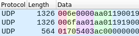

# Dependencies

- sudo apt install luajit luarocks

- sudo luarocks install luasocket
- sudo luarocks install lpack
- sudo luarocks install lua-brotli
- sudo luarocks install middleclass

# UDP packet format

| CMD | count | offset | nb_pixel | Data |
|-----:|-----:|-------:|---------:|-----:|
| u8   | u8   | u16    | u16      |  ?   |

- CMD :
    - **0x00** : Send RGB888 DATA
    - **0x01** : Send RGB888 DATA and update
    - **0x02** : Send RGB565 DATA
    - **0x03** : Send RGB565 DATA and update
    - **0x10** : Send Z888 DATA
    - **0x10** : Send Z888 DATA and update
- Count :
    - Increment by 1 every new UDP packet ( overflow at 256 )
- Offset:
    - When you need split the UDP show the offset data
- nb_pixel:
    - number of pixel in the UDP packet
- Data:
    - pixel Data

#### RGB888:
| CMD | count | offset | nb_pixel | Red | Green | Blue  | ...  |
|-----:|-----:|-------:|---------:|----:|------:|------:|-----:|
| u8   | u8   | u16    | u16      | u8  | u8    |  u8   | ...  |

##### example of 1024 Pixels send in 3 UDP packets

#### Z888:

| CMD | count | offset | nb_pixel | Compress RGB888 Data |
|-----:|-----:|-------:|---------:|---------------------:|
| u8   | u8   | u16    | u16      |  ...                 |

##### example of 1024 Pixels send in 1 UDP packets

<!-- # Animation format:

| type | FPS | Frame size | Frame nb | frames data |
|-----:|----:|-----------:|---------:|:-----------:|
| u8   | u16 | u16        | u16      |     ?       |

## Frame Data type:
### Brotli:
 | size | brotli data   |
 |-----:|:-------------:|
 | u16  |compress RGB888|

 #### RGB888:
 | Red | Green | Blue | ... |
 |----:|------:|-----:|:---:|
 | u8  |  u8   | u8   | ... |

  #### RGB565:
 | Red | Green | Blue | ... |
 |----:|------:|-----:|:---:|
 | u5  |  u6   | u5   | ... | -->
